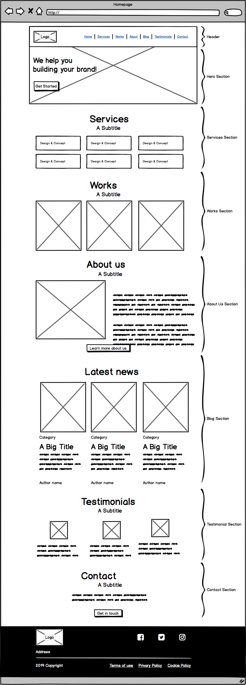

# ADVANCE HTML

## Sitemap of the project

<p align="center"></p>

## Wireframe of Techium project

<p align="center"></p>

## HTML - elements of a web page

### Doctype

The ```<doctype>``` is necessary at the top of every HTML page to force the browser to render the page according to relevant specifications.

```
<!-- Doctype HTML5 -->
<!DOCTYPE html>
<!-- Lowercase is also valid -->
<!doctype html>
```

### HTML tag

The ```<html>``` HTML tag tells the browser that the document is an HTML webpage. It is used as a container for all the HTML elements.

Warning!

The doctype is the only element living outside the html tag.

```
<html lang="fr" dir="ltr">
```

### Head tag

The ```head``` tag element contains all the metadatas related to your page. All the elements put in the head are not visible in the window of the browser.

A lot of metadatas exist, some specific to some CMS.

__Usage__
You can find inside the head:

* title of the webpage
* asynchronous script calls
* metadata
* CSS code embed (critical CSS)
* JavaScript code embed

### Meta charset

The ```meta``` charset declares the page’s character encoding.

```
...
<head>
    <!-- Set character encoding for the document -->
    <meta charset="value">
</head>
...
```

### Viewport

The meta ```viewport``` gives information about the initial size of the viewport.

Tip: The viewport is used by mobile devices only.

Accessibility tip: Never use ```maximum-scale=1.0```. It prevents the user from zooming in on the website. It causes an accessibility issue.

```
...
<head>
    ...
    <!-- Viewport for responsive web design -->
    <meta name="viewport" content="key=value, key=value">
</head>
...
```

### Title

The ```title``` meta tag defines the title of the web page.

Tip: The title is only visible on the tab/window of your browser.

Warning! The title should always have less than 56 characters.

```
...
  <head>
    ...
    <!-- Document Title -->
    <title>Page title</title>
  </head>
...
```

### Meta description
The meta ```description``` is the short paragraph of text placed in the HTML of a webpage that describes its content. The meta description will then appear under your page's URL in the search results. This is also known as a snippet

```
<head>
    ...
    <!-- Meta Description -->
    <meta name="description" content="Description of the page less than 150 characters">
  </head>
```

### Favicons

A favicon is a small image file that contains one or more icons that can be used to represent a website, blog, or even a single web page.

```
<head>
    ...
    <!-- Standard favicon -->
    <link rel="icon" type="image/x-icon" href="https://example.com/favicon.ico">
    <!-- Recommended favicon format -->
    <link rel="icon" type="image/png" href="https://example.com/favicon.png">
    ...
  </head>
```
### header tag

The ```<header>``` HTML tag element is used to identify the top of a webpage, article, section, or other segment of a page. The header is normally always the same across all pages of your website.

<p align="center"></p>

#### Usage
* logo of the website
* navigation
* search form

```
...
<body>
    <header>This is my header<header/>
</body>
```

Warning! The main element should never be a descendant of an article, aside, header, footer, or nav element.

Don’t confuse header with the head element of the page.

### Main tag

The ```<main>``` HTML tag is a structural element located generally between the ```<header>``` and the ```<footer>``` and contains the content of your web page.

<p align="center"></p>

### Footer tag

The ```<footer>``` HTML tag is a structural element used to identify the footer of a page, article, or section.

<p align="center"></p>

#### Usage
* copyright information
* authorship information
* navigation elements
* social icons or links

```
...
<body>
    <header>This is my header<header/>
    <main>
        This is where I put my content
    </main>
    <footer>This is the footer of my page</footer>
</body>
```

### aside tag
The <aside> HTML tag contains additional information related to the main content.

#### Usage
* monthly archives
* list of categories

### article tag
An ```<article>``` HTML tag represent a self-contained piece of content which could theoretically be distributed to other websites and platforms as a stand-alone unit.

#### Usage
* blog posts
* news articles
* product cards
* forum posts

### nav tag
The ```<nav>``` HTML tag is a structural element with navigation links.

## Resourses HTML

* [HTML TUTORIAL](https://www.w3schools.com/html/default.asp)
* [GUIDE HTML](https://htmlreference.io/)
* [DOCS HTML](https://developer.mozilla.org/en-US/docs/Web/HTML)